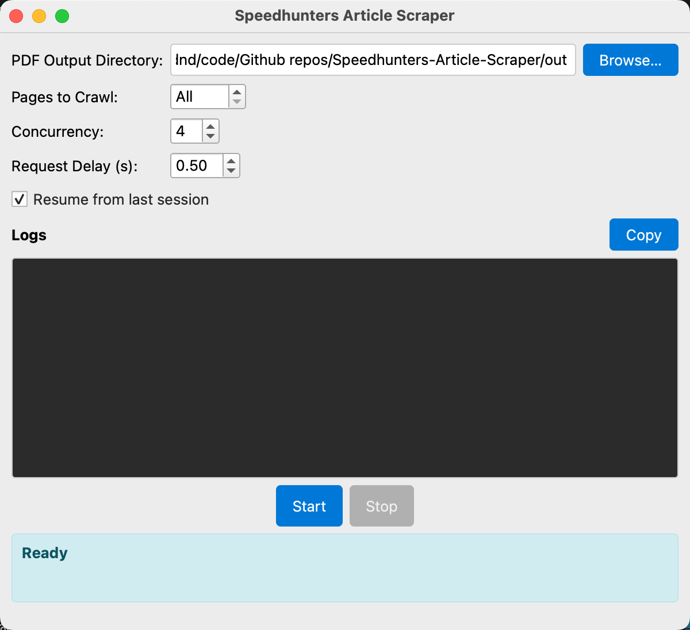

# Speedhunters Article Scraper

A desktop application for batch scraping articles from [Speedhunters](http://www.speedhunters.com/) and saving them as PDF files. It provides a graphical user interface (GUI) and supports features like concurrent downloads and resuming from the last session.



## 🚀 Installation and Setup

### 1. Prerequisites

- **Python**: 3.7+
- **Browser**: Microsoft Edge. This project is currently hardcoded to use the Edge browser. Please ensure it is installed.
- **WebDriver**: [Microsoft Edge Driver](https://developer.microsoft.com/en-us/microsoft-edge/tools/webdriver/). Selenium Manager usually handles driver downloads, but if there are issues, a manual download is provided as a fallback.

### 2. Installation Steps

1.  **Clone the repository**
    ```bash
    git clone https://github.com/your-username/Speedhunters-Article-Scraper.git
    cd Speedhunters-Article-Scraper
    ```

2.  **Create and activate a virtual environment (recommended)**
    ```bash
    # Windows
    python -m venv .venv
    .venv\Scripts\activate

    # macOS / Linux
    python3 -m venv .venv
    source .venv/bin/activate
    ```

3.  **Install dependencies**
    ```bash
    pip install -r requirements.txt
    ```

## 🛠️ Usage

1.  **Start the application**
    Run the following command in the project root directory:
    ```bash
    python app.py
    ```

## ⚠️ Disclaimer

- This project is for personal learning and technical research only. Do not use it for commercial purposes.
- Users should comply with the terms of use and copyright policies of the [Speedhunters](http://www.speedhunters.com/) website when using this tool.
- The developer is not responsible for any copyright disputes or legal issues that may arise from the use of this tool.
- Please use this tool responsibly and avoid putting excessive load on the target website's server.

## 📄 License

This project is open-sourced under the [MIT License](LICENSE).